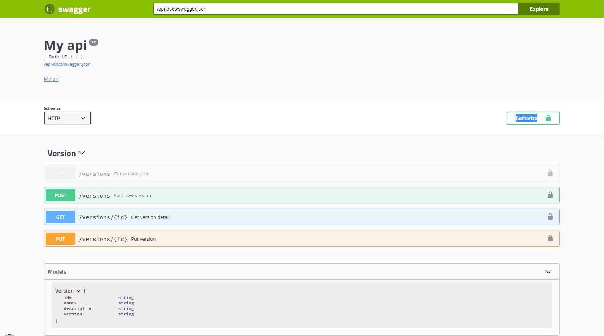

# swagger-express-ts
Automatically generate and serve swagger.json v2.0.

## Getting started

First, install [swagger-express-ts](https://www.npmjs.com/package/swagger-express-ts).

```sh
npm install swagger-express-ts --save
```

and [init tsconfig.json](./wiki/installation.md)

## The Basics

In the examples below, we use [inversify-express-utils](https://www.npmjs.com/package/inversify-express-utils). inversify-express-utils is not required to work with swagger-express-ts.

### Step 1: configure express

```ts
import * as bodyParser from "body-parser";
import * as express from "express";
import "reflect-metadata";
import { Container } from "inversify";
import { interfaces, InversifyExpressServer, TYPE } from "inversify-express-utils";
import { VersionController } from "./version/version.controller";
import * as swagger from "swagger-express-ts";
import { SwaggerDefinitionConstant } from "swagger-express-ts";
const config = require ( "../config.json" );

// set up container
const container = new Container ();

// note that you *must* bind your controllers to Controller
container.bind<interfaces.Controller> ( TYPE.Controller )
    .to( VersionController ).inSingletonScope().whenTargetNamed( VersionController.TARGET_NAME );

// create server
const server = new InversifyExpressServer ( container );

server.setConfig( ( app : any ) => {
    app.use( '/api-docs/swagger' , express.static( 'swagger' ) );
    app.use( '/api-docs/swagger/assets' , express.static( 'node_modules/swagger-ui-dist' ) );
    app.use( bodyParser.json() );
    app.use( swagger.express(
        {
            definition : {
                info : {
                    title : "My api" ,
                    version : "1.0"
                } ,
                externalDocs : {
                    url : "My url"
                }
                // Models can be defined here
            }
        }
    ) );
} );

server.setErrorConfig( ( app : any ) => {
    app.use( ( err : Error , request : express.Request , response : express.Response , next : express.NextFunction ) => {
        console.error( err.stack );
        response.status( 500 ).send( "Something broke!" );
    } );
} );

const app = server.build();

app.listen( config.port );
console.info( "Server is listening on port : " + config.port );

```

### Step 2: Decorate your models

```ts
@ApiModel( {
    description : "Version description" ,
    name : "Version"
} )
export class VersionModel {

    @ApiModelProperty( {
        description : "Id of version" ,
        required : true,
        example: ['123456789']
    } )
    id : number;

    @ApiModelProperty( {
        description : "" ,
        required : true
    } )
    name : string;

    @ApiModelProperty( {
        description : "Description of version" ,
        required : true
    } )
    description : string;
}
```

### Step 3: Decorate your controllers

```ts
@ApiPath({
    path: "/versions",
    name: "Version",
    security: { basicAuth: [] }
})
@controller("/versions")
@injectable()
export class VersionController implements interfaces.Controller {
    public static TARGET_NAME: string = "VersionController";
    
    private data = [{
            id: "1",
            name: "Version 1",
            description: "Description Version 1",
            version: "1.0.0"
        },
        {
            id: "2",
            name: "Version 2",
            description: "Description Version 2",
            version: "2.0.0"
        }];

    @ApiOperationGet({
        description: "Get versions objects list",
        summary: "Get versions list",
        responses: {
            200: { description: "Success", type: SwaggerDefinitionConstant.Response.Type.ARRAY, model: "Version" }
        },
        security: {
            apiKeyHeader: []
        }
    })
    @httpGet("/")
    public getVersions(request: express.Request, response: express.Response, next: express.NextFunction): void {
        response.json(this.data);
    }

    @ApiOperationPost({
        description: "Post version object",
        summary: "Post new version",
        parameters: {
            body: { description: "New version", required: true, model: "Version" }
        },
        responses: {
            200: { description: "Success" },
            400: { description: "Parameters fail" }
        }
    })
    @httpPost("/")
    public postVersion(request: express.Request, response: express.Response, next: express.NextFunction): void {
        if (!request.body) {
            return response.status(400).end();
        }
        this.data.push(request.body);
        response.json(request.body);
    }

}
```

### Step 4: Test

Start your server and test on url : /api-docs/swagger.json

## Extra

### Serve swagger-ui in your API

You can serve swagger.json and swagger-ui in your API.

```sh
npm install swagger-ui-dist --save
```

Create index.html in new directory "swagger".

```html
<!-- HTML for static distribution bundle build -->
<!DOCTYPE html>
<html lang="en">
<head>
    <meta charset="UTF-8">
    <title>Swagger UI</title>
    <link href="https://fonts.googleapis.com/css?family=Open+Sans:400,700|Source+Code+Pro:300,600|Titillium+Web:400,600,700"
          rel="stylesheet">
    <link rel="stylesheet" type="text/css" href="/api-docs/swagger/assets/swagger-ui.css">
    <link rel="icon" type="image/png" href="/api-docs/swagger/assets/favicon-32x32.png" sizes="32x32"/>
    <link rel="icon" type="image/png" href="/api-docs/swagger/assets/favicon-16x16.png" sizes="16x16"/>
    <style>
        html {
            box-sizing: border-box;
            overflow: -moz-scrollbars-vertical;
            overflow-y: scroll;
        }

        *,
        *:before,
        *:after {
            box-sizing: inherit;
        }

        body {
            margin: 0;
            background: #fafafa;
        }
    </style>
</head>

<body>

<svg xmlns="http://www.w3.org/2000/svg" xmlns:xlink="http://www.w3.org/1999/xlink"
     style="position:absolute;width:0;height:0">
    <defs>
        <symbol viewBox="0 0 20 20" id="unlocked">
            <path d="M15.8 8H14V5.6C14 2.703 12.665 1 10 1 7.334 1 6 2.703 6 5.6V6h2v-.801C8 3.754 8.797 3 10 3c1.203 0 2 .754 2 2.199V8H4c-.553 0-1 .646-1 1.199V17c0 .549.428 1.139.951 1.307l1.197.387C5.672 18.861 6.55 19 7.1 19h5.8c.549 0 1.428-.139 1.951-.307l1.196-.387c.524-.167.953-.757.953-1.306V9.199C17 8.646 16.352 8 15.8 8z"></path>
        </symbol>

        <symbol viewBox="0 0 20 20" id="locked">
            <path d="M15.8 8H14V5.6C14 2.703 12.665 1 10 1 7.334 1 6 2.703 6 5.6V8H4c-.553 0-1 .646-1 1.199V17c0 .549.428 1.139.951 1.307l1.197.387C5.672 18.861 6.55 19 7.1 19h5.8c.549 0 1.428-.139 1.951-.307l1.196-.387c.524-.167.953-.757.953-1.306V9.199C17 8.646 16.352 8 15.8 8zM12 8H8V5.199C8 3.754 8.797 3 10 3c1.203 0 2 .754 2 2.199V8z"/>
        </symbol>

        <symbol viewBox="0 0 20 20" id="close">
            <path d="M14.348 14.849c-.469.469-1.229.469-1.697 0L10 11.819l-2.651 3.029c-.469.469-1.229.469-1.697 0-.469-.469-.469-1.229 0-1.697l2.758-3.15-2.759-3.152c-.469-.469-.469-1.228 0-1.697.469-.469 1.228-.469 1.697 0L10 8.183l2.651-3.031c.469-.469 1.228-.469 1.697 0 .469.469.469 1.229 0 1.697l-2.758 3.152 2.758 3.15c.469.469.469 1.229 0 1.698z"/>
        </symbol>

        <symbol viewBox="0 0 20 20" id="large-arrow">
            <path d="M13.25 10L6.109 2.58c-.268-.27-.268-.707 0-.979.268-.27.701-.27.969 0l7.83 7.908c.268.271.268.709 0 .979l-7.83 7.908c-.268.271-.701.27-.969 0-.268-.269-.268-.707 0-.979L13.25 10z"/>
        </symbol>

        <symbol viewBox="0 0 20 20" id="large-arrow-down">
            <path d="M17.418 6.109c.272-.268.709-.268.979 0s.271.701 0 .969l-7.908 7.83c-.27.268-.707.268-.979 0l-7.908-7.83c-.27-.268-.27-.701 0-.969.271-.268.709-.268.979 0L10 13.25l7.418-7.141z"/>
        </symbol>


        <symbol viewBox="0 0 24 24" id="jump-to">
            <path d="M19 7v4H5.83l3.58-3.59L8 6l-6 6 6 6 1.41-1.41L5.83 13H21V7z"/>
        </symbol>

        <symbol viewBox="0 0 24 24" id="expand">
            <path d="M10 18h4v-2h-4v2zM3 6v2h18V6H3zm3 7h12v-2H6v2z"/>
        </symbol>

    </defs>
</svg>

<div id="swagger-ui"></div>

<script src="/api-docs/swagger/assets/swagger-ui-bundle.js"></script>
<script src="/api-docs/swagger/assets/swagger-ui-standalone-preset.js"></script>
<script>
    window.onload = function () {

        // Build a system
        const ui = SwaggerUIBundle ({
            url: "/api-docs/swagger.json",
            dom_id: '#swagger-ui',
            deepLinking: true,
            presets: [
                SwaggerUIBundle.presets.apis,
                SwaggerUIStandalonePreset
            ],
            plugins: [
                SwaggerUIBundle.plugins.DownloadUrl
            ],
            layout: "StandaloneLayout",
            validatorUrl: null
        });

        window.ui = ui
    }
</script>
</body>

</html>

```

Configure your server like that.

```ts
app.use( '/api-docs/swagger', express.static( 'swagger' ) );
app.use( '/api-docs/swagger/assets', express.static( 'node_modules/swagger-ui-dist' ) );
```

Test it on url "/api-docs/swagger".



## Project example

You can quickly test swagger-express-ts with the project example [example-swagger-express-ts](https://github.com/olivierlsc/example-swagger-express-ts).

## Features and API

- [Installation](./wiki/installation.md)
- [Configuration](./wiki/configuration.md)
- [@ApiModel](./wiki/api-model.decorator.md)
- [@ApiModelProperty](./wiki/api-model-property.decorator.md)
- [@ApiPath](./wiki/api-path.decorator.md)
- [@ApiOperationGet](./wiki/api-operation-get.decorator.md)
- [@ApiOperationPost](./wiki/api-operation-post.decorator.md)
- [@ApiOperationPut](./wiki/api-operation-put.decorator.md)
- [@ApiOperationPatch](./wiki/api-operation-patch.decorator.md)
- [@ApiOperationDelete](./wiki/api-operation-delete.decorator.md)

## For any questions, suggestions, or feature requests

[Please file an issue](https://github.com/olivierlsc/swagger-express-ts/issues)!

## Help wanted

swagger-express-ts wants additional maintainers! To maintain and continue to develop this young library, [Please post in this issue](https://github.com/olivierlsc/swagger-express-ts/issues/34).
